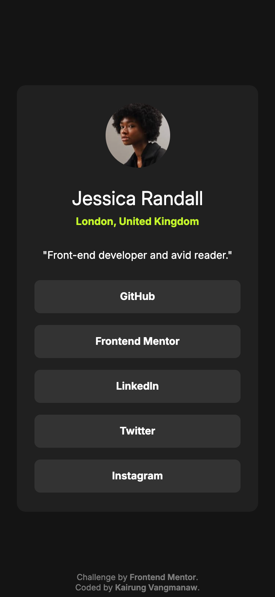

# Frontend Mentor - Social links profile solution


This is a solution to the [Social links profile challenge on Frontend Mentor](https://www.frontendmentor.io/challenges/social-links-profile-UG32l9m6dQ). Frontend Mentor challenges help you improve your coding skills by building realistic projects. 

## Table of contents

- [Frontend Mentor - Social links profile solution](#frontend-mentor---social-links-profile-solution)
  - [Table of contents](#table-of-contents)
  - [Overview](#overview)
    - [The challenge](#the-challenge)
    - [Screenshot](#screenshot)
    - [Links](#links)
  - [My process](#my-process)
    - [Built with](#built-with)
    - [What I learned](#what-i-learned)
    - [Continued development](#continued-development)
    - [Useful resources](#useful-resources)
    - [AI Collaboration](#ai-collaboration)
  - [Author](#author)
  - [Acknowledgments](#acknowledgments)

## Overview

### The challenge

Users should be able to:

- See hover and focus states for all interactive elements on the page

### Screenshot

<details>
  <summary>Mobile view</summary>
  
</details>
<details>
  <summary>Desktop view</summary>
  
</details>
<details>
  <summary>Active state view</summary>
  
</details>

### Links

- Solution URL: [Social Links Profile with React, CSS Custom Properties & GitHub Action](https://www.frontendmentor.io/solutions/test-qpWd-y8VlX)
- Live Site URL: [Frontend Mentor | Social links profile](https://challenged-by-frontend-mentor.github.io/social-links-profile/)

## My process

### Built with

- Semantic HTML5 markup
- CSS custom properties (variables defined by functional usage)
- Flexbox & Grid layouts
- Mobile-first workflow
- Responsive design with Media Queries
- **[React](https://reactjs.org/)** - Component-based UI library
- **GitHub Actions** - Automated CI/CD deployment pipeline to GitHub Pages
- **Pixel-perfect workflow**: Image overlay techniques & macOS Preview tool for precise pixel measurement


### What I learned

Refactoring this project from static HTML/CSS to React provided crucial insights—not only into technical implementations, but also into problem-solving mindsets:

- **Troubleshooting Beyond the Surface (`#root` Container)**: I spent a significant amount of time trying to fix sizing and layout issues, only to realize the root cause was the default constraints on React's `#root` container. This was a powerful lesson in **avoiding tunnel vision**—instead of fixating on the same CSS rules repeatedly, I learned to zoom out, inspect the entire DOM hierarchy, and analyze the problem holistically.
- **Automated Deployment with GitHub Actions**: Although YAML syntax was unfamiliar to me at first, I pushed through the trial-and-error process until the CI/CD pipeline deployed successfully. This experience demystified workflow configurations and sparked my interest in mastering YAML for future automation setups.
- **Layout-first Workflow**: Starting with structural wireframing before styling accelerated the entire development cycle.
- **Semantic CSS Variables**: Scoping CSS variables by usage area (e.g., `--button-bg`, `--card-bg`) made component styling scalable and easy to maintain.

```jsx
// React Component sample with accessible link structure
const SocialLink = ({ name, url }) => {
  return (
    <a 
      href={url} 
      className="social-link"
      target="_blank" 
      rel="noopener noreferrer"
      aria-label={`Visit my ${name} profile`}
    >
      {name}
    </a>
  );
};
```

### Continued development

For upcoming projects, I aim to focus on:
- Mastering YAML & CI/CD Pipelines: Learning the core syntax of .yml configuration files to write custom GitHub Actions workflows confidently from scratch.
- Holistic Debugging Habits: Applying a step-by-step checklist to inspect outer wrapper constraints (like #root or body) early in the debugging process before tweaking internal element styles.
- Advanced Accessibility (a11y): Enhancing keyboard navigation and standard screen reader integration.

### Useful resources

- [React Docs - Rendering Elements](https://react.dev/learn/rendering-lists) - Helped me understand component structure and how React renders elements into the DOM root container.
- [GitHub Actions Documentation for GitHub Pages](https://docs.github.com/en/pages/getting-started-with-github-pages/configuring-a-publishing-source-for-your-github-pages-site#publishing-with-a-custom-github-actions-workflow) - Essential guide for understanding CI/CD workflow configurations (`.yml`) and deploying static builds to GitHub Pages.
- [MDN Web Docs - CSS Layout and Centering](https://developer.mozilla.org/en-US/docs/Learn/CSS/Howto/Center_an_item) - Great reference for comparing layout-first positioning methods using Flexbox, Grid, and CSS transform techniques.

### AI Collaboration

I leveraged AI assistants as active pair-programming partners throughout this project:
- **Tools Used**: Gemini (for architectural guidance, React refactoring, and CI/CD troubleshooting) and Google Search AI mode (for rapid documentation and syntax checks).
- **Workflow Impact**: AI helped diagnose deployment script gaps in GitHub Actions, guided the base path routing adjustments, and provided valuable feedback during the debugging process.

## Author

- GitHub: [Kirung Vangmanaw](https://github.com/VangmanawKairung)
- Frontend Mentor - [@VangmanawKairung](https://www.frontendmentor.io/profile/VangmanawKairunge)

## Acknowledgments

I would like to express my sincere appreciation to:
- Myself, for remaining persistent through troubleshooting hurdles and continuously learning from mistakes.
- The **Frontend Mentor** community for providing real-world challenge setups.
- **Google** for **Gemini** and **Google Search AI mode**, which provided excellent guidance during refactoring and deployment setup.
- **Apple** for **Preview on macOS**, which served as a simple yet effective tool for inspecting design files and spec references.
